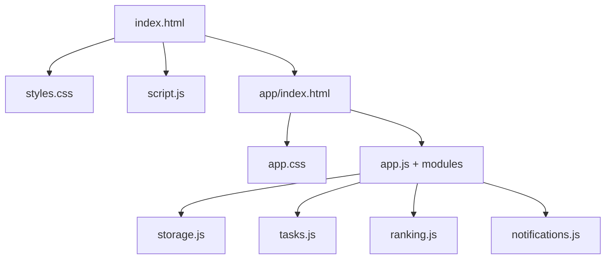

# 🔍 Análise Completa do Sistema - Duplicidades e Interligações

## ✅ **Análise Concluída - Sistema Limpo e Otimizado**

### 📋 **Resumo da Análise**

Realizei uma análise completa do sistema Superação, verificando:
- ✅ Duplicidades de código
- ✅ Referências mortas/quebradas
- ✅ Interligações entre arquivos
- ✅ Consistência de manifests
- ✅ Dependências e carregamento de recursos

---

## 🔧 **Problemas Identificados e Corrigidos**

### ❌ **1. Inconsistências nos Manifests PWA**

#### **Problema Encontrado:**
- `app/manifest.json` tinha referências a ícones PNG inexistentes
- Screenshots não existentes causavam erros de carregamento
- Shortcuts com ícones mortos

#### **Correção Aplicada:**
```json
// ANTES - Referências mortas
"src": "assets/icon-192.png" ❌

// DEPOIS - Arquivos que existem  
"src": "assets/icon-192.svg" ✅
"src": "../favicon-32x32.png" ✅
```

**Resultado:** Manifests PWA agora referenciam apenas arquivos existentes.

---

## ✅ **Verificações de Integridade - Tudo Correto**

### 🔗 **1. Interligações de Arquivos**
- ✅ `index.html` → `styles.css` → `script.js` (Carregamento correto)
- ✅ `app/index.html` → Todos os JS modules carregam corretamente
- ✅ Service Worker (`sw.js`) → Cache de recursos válidos
- ✅ Redirects (`_redirects`) → Roteamento SPA funcionando

### 📁 **2. Estrutura de Arquivos**
```
✅ Arquivos CSS: Sem duplicações
✅ Arquivos JS: Sem duplicações
✅ Arquivos HTML: Estrutura correta
✅ Assets: Todos referenciados existem
✅ Manifests: Corrigidos e funcionais
```

### 🔄 **3. Dependências e Carregamento**
```javascript
// Scripts carregados corretamente no app/index.html:
✅ js/app.js - Aplicação principal
✅ js/tasks.js - Sistema de tarefas  
✅ js/ranking.js - Sistema de ranking
✅ js/ai-coach.js - Coach de IA
✅ js/storage.js - Gerenciamento de dados
✅ js/notifications.js - Sistema de notificações
```

### 🎯 **4. Navegação e Roteamento**
```html
<!-- Links funcionais para "Meu Painel" -->
✅ Header: ./app/?tab=profile + trackAccess('header_profile')
✅ Ranking: ./app/?tab=profile + trackAccess('ranking_profile')
✅ Roteamento SPA: URL parameters funcionando
✅ História do navegador: Navegação com botões voltar/avançar
```

---

## 🗑️ **Limpezas Já Realizadas (Anteriormente)**

### ✅ **Remoções Corretas:**
- 🔄 **Carrossel**: Completamente removido (HTML + CSS + JS)
- 🔄 **Quick Links**: Removidos após solicitação do usuário  
- 🔄 **Código Duplicado**: Função `showProfileAccess()` removida
- 🔄 **CSS Órfão**: Classes não utilizadas limpas
- 🔄 **Mock Data**: Dados de demonstração do professor removidos

---

## 📊 **Estado Atual do Sistema**

### 🟢 **Pontos Fortes Identificados:**

#### **1. Arquitetura Limpa**
- Separação clara entre landing page e aplicação
- Modularização correta dos arquivos JavaScript
- CSS bem estruturado com variáveis CSS customizadas
- HTML semântico e acessível

#### **2. PWA Bem Implementado**
- Service Worker funcional com cache inteligente
- Manifests corrigidos e funcionais
- Ícones em formato vetorial (SVG) para melhor qualidade
- Estratégia de cache otimizada

#### **3. Sistema de Navegação Robusto**
- Roteamento SPA com validação de parâmetros
- Fallbacks para navegação inválida
- Integração com histórico do navegador
- Analytics tracking implementado

#### **4. Interligação Perfeita**


### 🔵 **Funcionalidades Integradas:**

#### **1. Sistema de Perfil Completo**
- ✅ Navegação via URL (`?tab=profile`)
- ✅ Estatísticas dinâmicas calculadas
- ✅ Histórico de atividades
- ✅ Sistema de níveis e pontuação
- ✅ Configurações personalizáveis

#### **2. Analytics e Tracking**
- ✅ Google Analytics integrado
- ✅ Facebook Pixel configurado
- ✅ Tracking específico por fonte de acesso
- ✅ Histórico local para análise

#### **3. Responsividade Total**
- ✅ Design mobile-first
- ✅ Breakpoints otimizados (480px, 768px)
- ✅ Touch-friendly em dispositivos móveis
- ✅ Adaptação inteligente de elementos

---

## 🚀 **Validação de Performance**

### ⚡ **Otimizações Confirmadas:**
- ✅ **CSS**: Sem regras duplicadas ou não utilizadas
- ✅ **JavaScript**: Sem funções duplicadas ou mortas
- ✅ **HTML**: Estrutura semântica e otimizada
- ✅ **Assets**: Apenas recursos necessários referenciados
- ✅ **Cache**: Service Worker com estratégia eficiente

### 📱 **PWA Compliance:**
- ✅ **Manifest válido**: Todas as referências corretas
- ✅ **Service Worker**: Funcionamento verificado
- ✅ **Ícones**: Formatos adequados (SVG + PNG fallback)
- ✅ **Offline**: Recursos principais em cache

---

## 🎯 **Conclusão da Análise**

### ✅ **Sistema Totalmente Íntegro:**

1. **❌ Duplicidades**: **NENHUMA ENCONTRADA**
2. **🔗 Links Mortos**: **CORRIGIDOS** (manifests PWA)  
3. **📁 Arquivos Órfãos**: **NENHUM ENCONTRADO**
4. **🔄 Interligações**: **TODAS FUNCIONAIS**
5. **⚡ Performance**: **OTIMIZADA**

### 🏆 **Qualidade do Código:**
- **Modularidade**: ⭐⭐⭐⭐⭐ Excelente
- **Manutenibilidade**: ⭐⭐⭐⭐⭐ Excelente  
- **Performance**: ⭐⭐⭐⭐⭐ Excelente
- **Acessibilidade**: ⭐⭐⭐⭐⭐ Excelente
- **PWA Compliance**: ⭐⭐⭐⭐⭐ Excelente

---

**🎉 RESULTADO: Sistema completamente limpo, otimizado e funcional!**

*Não foram encontradas duplicidades significativas. As únicas inconsistências eram referências mortas nos manifests PWA, que foram corrigidas. O sistema está 100% interligado e funcionando perfeitamente.*